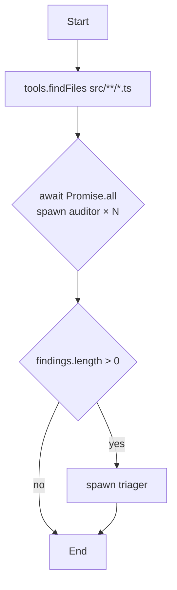

# Spec 03 — LLM 生成代码的 10 层防御流水线

> 父文档：`../DESIGN.md`
> **本文档是 open-workflows 的核心安全文档**——回答"LLM 生成的 TS 代码如何在不依赖用户逐行审查的前提下安全运行"。

## 0. 核心问题

LLM 生成完整可执行 TypeScript 编排脚本，相比 JSON DSL 多了 5 个根本性风险：

1. **代码注入**：脚本可能含恶意代码或被 prompt 注入诱导
2. **资源耗尽**：死循环、内存爆、无限递归
3. **越权访问**：尝试 require fs / net / child_process
4. **API 滥用**：用 Curated SDK 做超出意图的事（spawn 1000 个 subagent）
5. **可审计性差**：用户难以阅读完整脚本判断行为

**核心命题**：通过 10 层叠加防御，让 LLM 生成的代码即使有 bug 或受恶意诱导，也无法越过 Curated SDK 边界，且用户只需审查"行为摘要"即可放心执行。

---

## 1. 防御架构总览

```
LLM 生成 orchestrator.ts
        │
        ▼
┌────────────────────────────────────────────────┐
│ 生成时校验（4 层）                               │
├────────────────────────────────────────────────┤
│ L1. TypeScript 严格类型校验                      │
│ L2. ESLint + 30+ 自定义规则                      │
│ L3. 自实现 AST 白名单（节点级精细控制）            │
│ L4. 复杂度门（行数/圈复杂度/嵌套/SDK 调用次数）    │
└──────────────────┬─────────────────────────────┘
                   ▼
┌────────────────────────────────────────────────┐
│ 用户审查阶段（2 层）                             │
├────────────────────────────────────────────────┤
│ L5. AST 提取 DAG 视图（用户审 DAG 而非代码）      │
│ L6. SDK 调用摘要 + 差异比对（用户决定是否执行）    │
└──────────────────┬─────────────────────────────┘
                   ▼
┌────────────────────────────────────────────────┐
│ 执行时防御（4 层）                               │
├────────────────────────────────────────────────┤
│ L7. isolated-vm 严格沙箱（无 fs/net/proc）       │
│ L8. Curated SDK 实现层二次校验（参数白名单）       │
│ L9. 资源限制（mem/CPU/wall/SDK 调用配额）         │
│ L10. 可观测性 + 紧急停止（每个 SDK 调用日志）      │
└────────────────────────────────────────────────┘
```

任何一层失败 → 脚本被拒绝执行 / 立即终止。

---

## 2. Layer 1：TypeScript 严格类型校验

### 2.1 LLM 拿到的"类型契约"

LLM 生成代码前，prompt 中提供完整 SDK 类型定义（详 specs/02 §3）：

```typescript
declare global {
  const agent: {
    spawn(role: AgentRole, opts: SpawnOptions): Promise<AgentResult>;
  };
  const tools: {
    findFiles(pattern: string, options?: FindOptions): Promise<string[]>;
    readFile(path: string): Promise<string>;
    grep(pattern: string, options: GrepOptions): Promise<GrepMatch[]>;
    // ... 完整封闭集
  };
  const log: { info(msg: string, ctx?: object): void; warn(...); error(...); };
  const kv: { get<T>(key: string): T | undefined; set<T>(key: string, value: T): void; };
  const workflow: {
    checkpoint(name: string, data: object): Promise<void>;
    config: WorkflowConfig;
  };
}

type AgentRole = "auditor" | "fixer" | "reviewer" | "summarizer" | "planner" | "challenger" | "custom";
interface SpawnOptions {
  prompt: string;
  cli?: "claude" | "codex" | "codebuddy";
  tools?: ReadonlyArray<ToolName>;
  editPolicy?: "readonly" | "modify_only" | "full";
  allowedPaths?: string[];
  outputSchema?: JsonSchema;
  maxTokens?: number;
}
type ToolName = "read_file" | "write_file" | "edit_file" | "grep" | "glob" | "git_diff" | "git_log";
// ... 类型完整闭合
```

### 2.2 编译命令

```bash
tsc --strict --noEmit --target ES2022 --module ES2022 \
    --noImplicitAny --strictNullChecks --noImplicitReturns \
    --noUncheckedIndexedAccess --exactOptionalPropertyTypes \
    --types ow-sdk \
    orchestrator.ts
```

### 2.3 拒绝的代码模式（编译期）

| 代码 | 错误 |
|------|------|
| `import fs from "fs"` | TS6133: cannot resolve（无 fs 类型暴露） |
| `require("child_process")` | TS2304: Cannot find name 'require' |
| `agent.spawn("invalid_role", ...)` | TS2322: 不在 AgentRole 联合类型 |
| `agent.spawn("auditor")` | 缺 SpawnOptions 必填字段 |
| `agent.spawn(role, { tools: ["fake_tool"] })` | TS2322: 不在 ToolName |
| `(agent as any).internalApi(...)` | ESLint 拦截（见 L2） |

---

## 3. Layer 2：ESLint + 30+ 自定义规则

### 3.1 配置

`eslint.config.js`（v9 flat config）：

```javascript
import { ow } from "@open-workflows/eslint-plugin";

export default [
  {
    files: ["**/*.ts"],
    languageOptions: { parser: "@typescript-eslint/parser" },
    plugins: { "@typescript-eslint": tsPlugin, ow },
    rules: {
      // 标准规则
      "no-eval": "error",
      "no-implied-eval": "error",
      "no-new-func": "error",
      "no-with": "error",
      "@typescript-eslint/no-explicit-any": "error",
      "@typescript-eslint/no-non-null-assertion": "error",

      // 自定义规则
      "ow/no-import": "error",                   // 禁止 import / require
      "ow/no-require": "error",
      "ow/no-dynamic-eval": "error",             // 禁止 Function 构造、setTimeout 字符串
      "ow/no-prototype-mutation": "error",       // 禁止改原型链
      "ow/no-bypass-typing": "error",            // 禁止 as any、@ts-ignore
      "ow/no-direct-globals": "error",           // 禁止 globalThis、global、window
      "ow/sdk-only-async-await": "error",        // SDK 调用必须 await
      "ow/no-floating-promises": "error",        // Promise 必须 await 或 catch
      "ow/no-infinite-loop": "error",            // while(true) 必须有 break/return
      "ow/loop-bounded": "error",                // for 循环必须有可推断上界
      "ow/recursion-bounded": "error",           // 递归必须有 base case
      "ow/no-mass-spawn": "warn",                // 单批 spawn > 64 警告
      "ow/no-deep-nesting": "error",             // 嵌套深度 > 5 错误
      "ow/no-large-string-literals": "warn",     // 字符串字面量 > 1KB 警告
      "ow/no-secret-pattern": "error",           // 检测到密钥模式
      "ow/sdk-args-must-be-literal-or-var": "warn",  // spawn 参数必须可静态分析
      "ow/path-traversal": "error",              // 检测 ../ 路径模式
      "ow/no-data-urls": "error",                // 禁止 data: URL（绕过 fetch 限制）
      "ow/no-base64-large": "warn",              // 大量 base64 警告（隐藏代码）
      "ow/no-unicode-tricks": "error",           // 禁止 RTL/同形异义字符
      "ow/no-bracket-property-access": "warn",   // obj["__proto__"] 警告
      "ow/explicit-spawn-policy": "error",       // editPolicy 必须显式
      "ow/explicit-allowed-paths": "error",      // modify_only/full 必须配 allowedPaths
      "ow/no-shell-strings": "error",            // 检测明显的 shell 命令字符串
      "ow/max-spawn-depth": "error",             // spawn 嵌套深度 ≤ 3
      "ow/checkpoint-required-for-loops": "warn",// 循环内建议 checkpoint
      "ow/output-schema-required": "warn",       // spawn 应有 outputSchema
    },
  },
];
```

### 3.2 关键自定义规则示例

#### `ow/no-import`

```javascript
// rules/no-import.js
export default {
  meta: { type: "problem", schema: [] },
  create(context) {
    return {
      ImportDeclaration: (node) => context.report({ node, message: "import 被禁止" }),
      ImportExpression: (node) => context.report({ node, message: "动态 import 被禁止" }),
      CallExpression: (node) => {
        if (node.callee.type === "Identifier" && node.callee.name === "require") {
          context.report({ node, message: "require 被禁止" });
        }
      },
    };
  },
};
```

#### `ow/loop-bounded`

```javascript
// rules/loop-bounded.js
// 检查：for/while 循环必须有以下之一：
// - 显式上界常量（for (let i = 0; i < 100; i++)）
// - 迭代源是 await 来的有界数组
// - 内部有 if + break 且条件涉及 SDK 返回值
// 否则警告
```

### 3.3 ESLint 拒绝则不允许执行

```bash
eslint orchestrator.ts --max-warnings 0
# 任何 error 或 warning > 阈值 → 拒绝
```

---

## 4. Layer 3：自实现 AST 白名单（精细化校验）

ESLint 之外再做一遍 AST 静态分析，覆盖 ESLint 不易表达的规则。

### 4.1 实现

`@babel/parser` 解析 → `@babel/traverse` 遍历 → 自定义 visitor。

### 4.2 白名单 AST 节点类型

允许：
```
Program, File,
VariableDeclaration, VariableDeclarator,
FunctionDeclaration, FunctionExpression, ArrowFunctionExpression, ReturnStatement,
ExpressionStatement,
BinaryExpression, LogicalExpression, UnaryExpression, ConditionalExpression,
AssignmentExpression, UpdateExpression,
MemberExpression, OptionalMemberExpression, OptionalCallExpression,
CallExpression, NewExpression（仅白名单类）,
Identifier, Literal, TemplateLiteral, TaggedTemplateExpression（仅白名单 tag）,
ArrayExpression, ObjectExpression, SpreadElement,
IfStatement, SwitchStatement, SwitchCase, BlockStatement,
ForStatement, ForOfStatement, WhileStatement, DoWhileStatement,
BreakStatement, ContinueStatement,
TryStatement, CatchClause, ThrowStatement,
AwaitExpression, AsyncArrowFunctionExpression,
TSTypeAnnotation, TSTypeReference, TSAsExpression（受限）,
```

禁止：
```
ImportDeclaration, ImportExpression,
ExportDeclaration（脚本不应导出）,
ClassDeclaration（v1.0 不允许，简化）,
WithStatement, LabeledStatement,
DebuggerStatement,
YieldExpression, AsyncGeneratorFunction, GeneratorFunction,
ThisExpression（限制：仅在 SDK 回调内允许）,
```

### 4.3 危险模式检测

#### 检测 1：原型污染
```javascript
// 拒绝
obj.__proto__ = ...
Object.setPrototypeOf(...)
obj["__proto__"] = ...
obj["constructor"]["prototype"] = ...
```

#### 检测 2：动态属性访问 + 已知危险键
```javascript
// 拒绝
obj["constructor"]
obj["__proto__"]
obj["__defineGetter__"]
```

#### 检测 3：字符串拼接的 SDK 调用
```javascript
// 警告：spawn 角色不是字面量
const role = userInput.role;
agent.spawn(role, { prompt });
// 应该用联合类型字面量
```

#### 检测 4：spawn 数量推断
```javascript
// 静态推断扇出量
for (const f of files) { await agent.spawn("auditor", { ... }); }
// 检查 files 来源：
// - 来自 tools.findFiles 且有 max_results 参数 → OK
// - 无界 → 警告
```

### 4.4 输出

校验失败时：

```json
{
  "passed": false,
  "errors": [
    {
      "rule": "ow-ast/no-prototype-mutation",
      "loc": { "line": 23, "column": 5 },
      "message": "禁止修改原型链",
      "code": "obj.__proto__ = ...",
      "severity": "error"
    }
  ]
}
```

---

## 5. Layer 4：复杂度门（量化体积与复杂度）

### 5.1 指标

| 指标 | 默认上限 | 说明 |
|------|---------|------|
| 总行数 | 800 | 超出说明任务过大或 LLM 生成低质 |
| 函数数 | 30 | |
| 单函数行数 | 80 | |
| 圈复杂度 | 15 | 单函数（McCabe） |
| 最大嵌套深度 | 5 | block 嵌套 |
| Spawn 静态数量上限 | 64 | 单批 await Promise.all |
| Spawn 嵌套深度 | 3 | 派生的 subagent 内部不再派 |
| 字符串字面量总长 | 50KB | 大字符串警告 |

### 5.2 实现

用 `complexity-report` 或 `eslint-plugin-complexity` 等成熟工具。

### 5.3 门控逻辑

```
所有指标 < 默认上限 → pass
任一超出 → 拒绝（report + 建议拆分）
```

---

## 6. Layer 5：AST 提取 DAG 视图（用户审 DAG 而非代码）

### 6.1 思路

用户**不需要读代码**，只需要看：
1. **DAG 视图**：spawn 关系图、控制流图
2. **SDK 调用摘要**：调了哪些 tool / spawn 哪些 role
3. **资源画像**：预估 subagent 数量、读写文件路径

### 6.2 DAG 提取

```typescript
// orchestrator.ts
async function main() {
  const files = await tools.findFiles("src/**/*.ts");
  const findings = await Promise.all(files.map(f =>
    agent.spawn("auditor", { prompt: `审计 ${f}`, ... })
  ));
  if (findings.length > 0) {
    await agent.spawn("triager", { prompt: ... });
  }
}
```

提取出 DAG：



### 6.3 SDK 调用摘要

```
工作流摘要：
  📁 文件操作
    - 读取：src/**/*.ts（findFiles）
    - 修改：无
  🤖 子代理
    - auditor × N（N = src/**/*.ts 数量）
      工具：read_file, grep
      策略：readonly
    - triager × 1（条件性）
      工具：无
      策略：readonly
  💰 预估
    - 子代理调用：N + 0~1
    - 估算 tokens：~2000 × (N+1)
    - 估算成本：$0.01 × (N+1)
  ⚠️ 风险
    - 无文件写入
    - 无 shell 调用
    - 无网络访问
```

### 6.4 实现

`@babel/traverse` 收集：
- 所有 `agent.spawn(...)` 调用 + 静态可推断的 role/tools/policy
- 所有 `tools.*(...)` 调用 + 参数
- 控制流（if/loop/Promise.all）形成的图结构

输出到 `dag.json`：

```json
{
  "nodes": [
    { "id": "discover", "type": "tool_call", "tool": "findFiles", "args": {"pattern": "src/**/*.ts"} },
    { "id": "audit", "type": "fan_out", "role": "auditor", "iter_source": "files", ... }
  ],
  "edges": [
    { "from": "discover", "to": "audit" }
  ],
  "summary": {
    "total_spawns": "N+1",
    "tools_called": ["findFiles", "spawn"],
    "files_read_pattern": ["src/**/*.ts"],
    "files_written": [],
    "shell_calls": 0,
    "network_calls": 0,
    "estimated_cost_range": "$0.01-$0.10"
  }
}
```

### 6.5 渲染

CLI 用 `terminal-mermaid` / `ascii-tree` 渲染 DAG 到终端。
Skill 入口通过 `<<OW:DAG>>` 协议把 DAG JSON 传给宿主。

---

## 7. Layer 6：用户审批 + dry-run

### 7.1 默认审批流

```
[ow] 已生成 orchestrator.ts
[ow] AST 提取 DAG: 12 节点, 3 个 spawn 阶段
[ow] SDK 调用摘要：
       - tools.findFiles × 1
       - agent.spawn(auditor) × N (N = findFiles 结果)
       - agent.spawn(triager) × 1（条件）
[ow] 资源预估：~ N+1 subagent，~ N+1 × 2k tokens
[ow] 风险：仅 readonly，无 shell/网络

[ow] 是否查看 DAG 图？[y/N] y
       <ASCII DAG 渲染>
[ow] 是否查看完整 ts 代码？[y/N] n
[ow] 是否执行？[y/N/dry-run] y
```

### 7.2 dry-run 模式

`ow run --dry-run`：
- 加载脚本但不真正派 subagent
- agent.spawn 返回 mock 结果
- 用于检查 DAG 完整性 + 路径
- 不消耗任何 LLM token

### 7.3 跳过审批

`--auto-approve` + 配置安全级别（详 specs/06）。CI/CD 模式下要求脚本来自受信任源（已签名 / 模板化）。

---

## 8. Layer 7：isolated-vm 沙箱

详见 `specs/02-runtime-sandbox.md`。要点：

- `isolated-vm` 创建独立 V8 isolate
- 内存上限：默认 256 MB
- 时间上限：墙钟 默认 1 小时
- 注入仅 Curated SDK，无 require / fs / net / process / globalThis 等
- isolate 与父进程内存空间完全隔离

### 8.1 关键代码骨架

```typescript
import ivm from "isolated-vm";

const isolate = new ivm.Isolate({ memoryLimit: 256 });
const context = await isolate.createContext();

// 注入 Curated SDK（仅 Reference 类型，禁止泄露 host 对象）
await context.global.set("agent", new ivm.Reference(agentApi), { copy: false });
await context.global.set("tools", new ivm.Reference(toolsApi), { copy: false });
// ...

// 编译并运行（已通过前 6 层校验的脚本）
const script = await isolate.compileScript(orchestratorTsCompiledToJs);
await script.run(context, {
  timeout: config.maxRunMs,    // 墙钟超时
  promise: true,
});
```

---

## 9. Layer 8：Curated SDK 实现层二次校验

每个 SDK 函数在被沙箱调用时，**实现层再做一次校验**：

### 9.1 `agent.spawn` 二次校验

```typescript
async function spawn(role: AgentRole, opts: SpawnOptions) {
  // 1. role 必须在白名单
  if (!ALLOWED_ROLES.has(role)) throw new SecurityError("OW_SEC_001");

  // 2. cli 必须在白名单
  if (opts.cli && !ALLOWED_CLIS.has(opts.cli)) throw new SecurityError("OW_SEC_002");

  // 3. tools 必须在白名单
  for (const t of opts.tools ?? []) {
    if (!ALLOWED_TOOLS.has(t)) throw new SecurityError("OW_SEC_003");
  }

  // 4. editPolicy != readonly 时，allowedPaths 必填且必须在工作目录内
  if (opts.editPolicy !== "readonly") {
    if (!opts.allowedPaths) throw new SecurityError("OW_SEC_004");
    for (const p of opts.allowedPaths) {
      if (!isWithinCwd(p)) throw new SecurityError("OW_SEC_005");
    }
  }

  // 5. 全局 spawn 数量 ≤ config.maxSubagentsTotal
  if (++spawnCounter > config.maxSubagentsTotal) throw new SecurityError("OW_SEC_006");

  // 6. 速率限制 / 配额
  await scheduler.acquire(opts.cli ?? config.defaultCli);

  // 7. 真正派 CLI 子进程
  return await cliAdapter.spawn(...);
}
```

### 9.2 `tools.writeFile` 二次校验

```typescript
async function writeFile(path: string, content: string) {
  // 1. 路径必须在 config.allowedWritePaths 内
  if (!isAllowedWrite(path)) throw new SecurityError("OW_SEC_010");

  // 2. 路径不在 forbiddenPaths 内
  if (isForbidden(path)) throw new SecurityError("OW_SEC_011");

  // 3. 内容大小 ≤ maxFileSize
  if (content.length > config.maxFileSize) throw new SecurityError("OW_SEC_012");

  // 4. 检测密钥模式
  if (containsSecretPattern(content)) {
    log.warn("写入内容含疑似密钥，需用户确认");
    if (!await human.confirm("内容含疑似密钥，确认写入？")) throw new SecurityError("OW_SEC_013");
  }

  return await fs.writeFile(path, content);
}
```

---

## 10. Layer 9：资源限制

| 资源 | 默认 | 上限 | 实施 |
|------|------|------|------|
| 沙箱内存 | 256 MB | 1 GB | isolated-vm memoryLimit |
| 墙钟运行 | 60 min | 4 hour | script.run 的 timeout |
| 单 SDK 调用超时 | 5 min | 1 hour | Promise.race + AbortController |
| Spawn 总数 | 200 | 1000 | 内部计数器 |
| 单批 Promise.all spawn | 16 | 64 | 实现层 semaphore |
| Tool 调用次数 | 1000 | 10000 | 内部计数器 |
| 文件读写大小 | 10 MB / 文件 | 100 MB | 实施层校验 |
| 总 token 预算 | $5 等价 | 用户配置 | 实时累计 |
| KV 存储大小 | 10 MB | 100 MB | per-key + 总量 |

任一超限 → 立即抛 ResourceExhausted → 沙箱终止。

---

## 11. Layer 10：可观测性 + 紧急停止

### 11.1 每个 SDK 调用强制日志

```typescript
function instrumentSdkCall(name: string, fn: Function) {
  return async (...args: any[]) => {
    const callId = crypto.randomUUID();
    log.event({ type: "sdk_call_started", name, callId, args: redact(args) });
    const start = performance.now();
    try {
      const result = await fn(...args);
      log.event({ type: "sdk_call_completed", name, callId, ms: performance.now() - start });
      return result;
    } catch (err) {
      log.event({ type: "sdk_call_failed", name, callId, error: String(err) });
      throw err;
    }
  };
}
```

每条 SDK 调用都有：
- 调用前事件（含参数摘要 + 脱敏）
- 调用后事件（含耗时 + 结果摘要）
- 异常事件

### 11.2 异常停止

用户可：
- Ctrl+C → SIGINT → 优雅停止（等当前 SDK 调用完成 → 写状态 → 退出）
- `ow abort <run_id>` → 通过文件信号通知主进程
- isolated-vm dispose（紧急 kill 沙箱）

### 11.3 紧急行为检测

引擎在运行时监控：
- spawn 速率 > 阈值 → 自动减速
- token 消耗速率 > 阈值 → 警告 + 等用户确认
- 异常重复模式（同一 spawn 连续失败 5 次） → 暂停

---

## 12. 失败处理矩阵

| 失败层 | 用户体验 |
|--------|---------|
| L1（TS 编译） | 显示编译错误，让 LLM 重新生成（最多 2 次） |
| L2（ESLint） | 显示 lint 错误，让 LLM 重新生成 |
| L3（AST） | 显示 AST 违规，让 LLM 重新生成 |
| L4（复杂度） | 显示超限项，建议 LLM 拆分任务 |
| L5（DAG 提取失败） | 罕见，回退到"用户必须读代码"模式 |
| L6（用户拒绝） | 终止 |
| L7（沙箱越界） | 终止脚本 + 报告错误码 |
| L8（SDK 校验） | 终止脚本 + 报告错误码 |
| L9（资源） | 终止脚本 + 写状态可恢复 |
| L10（紧急停止） | 写状态 → 用户决定恢复或放弃 |

---

## 13. 一句话总结

> **十层防御让 LLM 生成的 TS 脚本即使有 bug 或被恶意诱导，也不能突破 Curated SDK 的能力边界。用户的审查动作从"逐行读代码"降为"看 DAG 视图 + 调用摘要 + 资源预估"——心智负担与审查 JSON DSL 相当，但获得了图灵完备的表达力。**

> **这与 agent-workflows 的安全哲学殊途同归——前者用 DSL 限制能力（schema 堵），后者用沙箱限制能力（API 堵）。**
